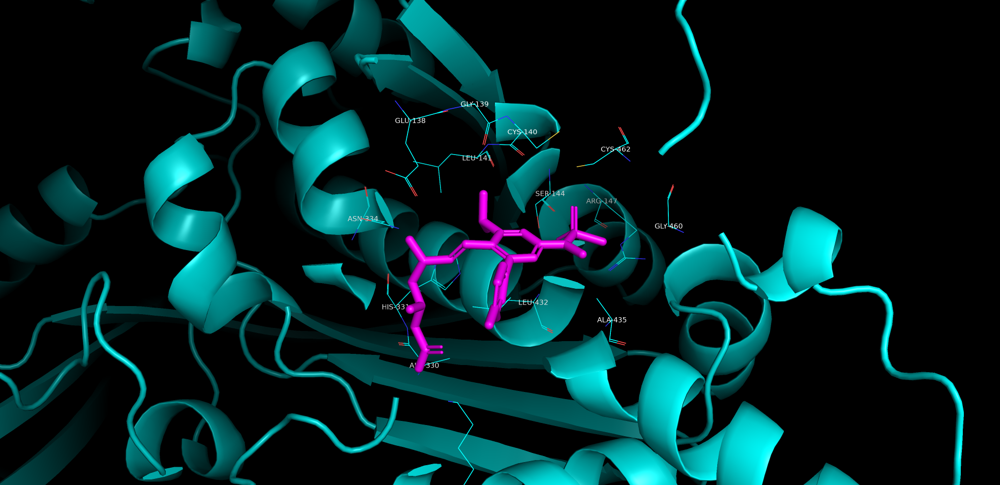

# fold

Protein structure prediction and protein/ligand cofolding, with no local GPU
required.

OpenFold3 and ESMFold need more VRAM than most machines have locally, so
those run on [Modal](https://modal.com/) instead — all you need locally is
CPU and a Modal account. ESM2 embeddings are small enough to run on CPU
directly. The split:

| Tool | What it does | Where it runs | Why |
|---|---|---|---|
| [OpenFold3](https://github.com/aqlaboratory/openfold-3) | Protein + ligand cofolding | Modal GPU (A10G) | needs 32GB+ VRAM |
| [RosettaFold3 (RF3)](https://github.com/RosettaCommons/foundry) | Protein + ligand cofolding (independent method, for cross-checking) | Modal GPU (A10G) | same VRAM class as OpenFold3 |
| [ESMFold](https://huggingface.co/facebook/esmfold_v1) | Single-sequence structure prediction | Modal GPU (A10G) | ~3B-param backbone, ~11GB of weights |
| ESM2 | Protein embeddings + cosine similarity | Local CPU | small enough (650M params, ~2.6GB) to run comfortably on CPU |

Both GPU workloads cache their model weights in a persistent [Modal
Volume](https://modal.com/docs/guide/volumes) on first run, so subsequent
runs skip the multi-GB download. The local ESM2 path uses the standard
HuggingFace Hub cache (`~/.cache/huggingface`), which works the same way.

## Setup

1. Install [uv](https://docs.astral.sh/uv/) if you don't have it.
2. Clone this repo and install dependencies:

   ```bash
   git clone https://github.com/MauricioCafiero/fold.git
   cd fold
   uv sync
   ```

3. Authenticate with [Modal](https://modal.com/) (needed for cofolding and
   ESMFold, not for the local ESM2 embeddings):

   ```bash
   uv run modal setup
   ```

   This opens a browser flow and writes a token to `~/.modal.toml`. Verify it
   worked with `uv run modal profile current`.

### No Modal account? Use the Colab notebook instead

[`notebooks/fold_colab.ipynb`](notebooks/fold_colab.ipynb) runs the same
four tools directly on a Colab GPU runtime instead of dispatching to Modal —
open it in Google Colab, no Modal account needed. It shares the exact same
core logic as the Modal apps (`fold.openfold3_core`, `fold.rf3_core`,
`fold.esmfold_core`), just invoked in-process instead of on a remote
container.

**⚠️ Experimental** — this path hasn't been run end-to-end on live Colab yet
(unlike everything else in this README, which has real verified results
below). The model-running logic itself isn't new or unverified — it's the
same `run_predict`/`fold_sequence` functions the Modal apps call, confirmed
working via the smoke tests below. What's untested is specifically the
Colab install environment: `pip install openfold3[deepspeed]` /
`rc-foundry[rf3]` / `transformers` on whatever CUDA/driver/preinstalled-torch
versions Colab happens to be running, which can shift over time. This
caveat comes out once someone confirms a clean run.

Also usable directly (no notebook) on any machine with a CUDA GPU already
set up:

```bash
python -m fold.local_run openfold3 --input-file examples/hmgcr_rosuvastatin.txt
python -m fold.local_run rf3 --sequence "..." --smiles "..."
python -m fold.local_run esmfold --sequence "..."
```

## Usage

### Protein/ligand cofolding (OpenFold3)

Runs on a Modal A10G GPU. `--detach` keeps the job running on Modal even if
your machine sleeps or disconnects.

```bash
uv run modal run --detach src/fold/app.py::main \
  --sequence "YOUR_PROTEIN_SEQUENCE" \
  --smiles "YOUR_LIGAND_SMILES" \
  --job-name my_target
```

Omit `--sequence`/`--smiles` to run the built-in smoke test instead: human
HMG-CoA reductase (catalytic domain, the exact construct from [PDB
1HWL](https://www.rcsb.org/structure/1HWL)) cofolded with rosuvastatin.

Or point at a plain-text file instead of typing the sequence/SMILES inline:

```bash
uv run modal run --detach src/fold/app.py::main \
  --input-file examples/hmgcr_rosuvastatin.txt
```

The file format is two lines (order doesn't matter, prefixes are
case-insensitive):

```
SEQUENCE: MLSRLFRMHGLFVASHPWEVIVG...
SMILES: CC(C)C1=NC(=NC(=C1)...
```

`--input-file` takes precedence over `--sequence`/`--smiles` if both are
given. If `--job-name` isn't also given, it's derived from the input file's
stem (`hmgcr_rosuvastatin.txt` → job name `hmgcr_rosuvastatin`); with
neither `--input-file` nor `--job-name`, it falls back to the neutral name
`prediction` rather than anything tied to the built-in smoke test. Same
behavior applies identically to the RF3 CLI below.

MSAs are computed remotely via the ColabFold MSA server (no local sequence
databases needed). Output structures (`.cif`), per-sample confidence scores,
and run metadata land in `outputs/<job_name>/`.

A single run currently takes ~7 minutes on A10G (mostly diffusion sampling;
the remote MSA search itself is seconds). First run is much slower — it has
to build the container image and download the ~2.1GB checkpoint.

### Protein/ligand cofolding, second opinion (RosettaFold3)

Same idea as OpenFold3 above, but an architecturally independent model —
useful for cross-checking a prediction rather than trusting one method's
confidence score alone.

```bash
uv run modal run --detach src/fold/rf3_app.py::main \
  --sequence "YOUR_PROTEIN_SEQUENCE" \
  --smiles "YOUR_LIGAND_SMILES" \
  --job-name my_target
```

Omit `--sequence`/`--smiles` for the same HMGCR + rosuvastatin smoke test.

RF3's own CLI has no MSA search built in (its README says on-the-fly MSA
computation is "on the roadmap", not implemented yet) — only a `msa_path`
field for a precomputed `.a3m`/`.fasta`. `rf3_app.py` fills that gap itself:
by default (`--use-msa`, on unless you pass `--no-use-msa`) it queries the
same public ColabFold MSA server OpenFold3 uses internally, saves the result
as an `.a3m`, and wires it in per protein component before calling `rf3
fold`. This is what makes the RF3 vs. OpenFold3 comparison below fair.

Output lands in `outputs/rf3_<job_name>/`, structured as `.cif` models plus
`_confidences.json`/`_summary_confidences.json` per sample.

### Single-sequence folding (ESMFold)

No MSA step needed — much simpler and faster than cofolding.

```bash
uv run modal run --detach src/fold/esmfold_app.py::main \
  --sequence "YOUR_PROTEIN_SEQUENCE"
```

Writes a `.pdb` file to `outputs/esmfold_prediction.pdb` (path configurable
via `--out-path`). Omit `--sequence` to run the same HMGCR construct as a
smoke test.

### Protein embeddings + similarity (ESM2, local)

No Modal, no GPU — runs directly on CPU.

```python
from fold.embeddings import embed_sequence, cosine_similarity

vec = embed_sequence("MLSRLFRMHGLFVASHPWEVIVG...")
sim = cosine_similarity(seq_a, seq_b)
```

Uses `facebook/esm2_t33_650M_UR50D` by default; pass `model_name=` to use a
different ESM2 checkpoint size.

## Post-processing

### CIF → PDB conversion

For MD tools (GROMACS, OpenMM, AMBER, ...) that want PDB input:

```bash
python -m fold.analyze cif-to-pdb outputs/hmgcr_rosuvastatin_smoketest/hmgcr_rosuvastatin_smoketest/seed_42/hmgcr_rosuvastatin_smoketest_seed_42_sample_5_model.cif
```

Uses [gemmi](https://gemmi.readthedocs.io/); preserves chains, HETATM
records, and per-atom B-factors (pLDDT).

### Binding energy (AutoDock Vina)

Calculates a real, numeric binding affinity for a cofolded complex — not
just a confidence score. Needs the optional `docking` extra and the
`obabel` CLI (Open Babel) on PATH:

```bash
uv sync --extra docking
python -m fold.analyze binding-energy outputs/hmgcr_rosuvastatin_smoketest \
  --smiles "YOUR_LIGAND_SMILES"
```

Picks the best-ranked structure from the job's output directory
(`fold.results.find_best_cif` — RF3 already promotes an aggregate top pick;
OpenFold3 compares all samples by their ranking-score confidence field),
converts it to PDB, splits out the ligand (chain auto-detected from HETATM
records — OpenFold3 and RF3 don't agree on a chain letter for it), and runs
AutoDock Vina with the search box **anchored at the ligand's own predicted
position** — not a blind pocket search, not a from-scratch redock — so the
reported affinity reflects the pose the cofolding tool actually produced.

The docking code (`fold.vina_dock_core`) is adapted from
[MauricioCafiero/dock_assist](https://github.com/MauricioCafiero/dock_assist)
— vendored directly into this repo (not an external/sibling-directory
dependency), trimmed to the single "dock at a known site" path used here.
Vina uses all available CPU cores by default, no config needed.

## Development

Local-only checks that don't touch Modal or GPUs:

```bash
uv run pytest
```

Covers the `SEQUENCE:`/`SMILES:` input-file parser
(`fold.inputs.parse_sequence_smiles_file`), picking the best-ranked
structure from a job's output directory (`fold.results.find_best_cif`),
and the receptor/ligand-splitting logic in `fold.binding_energy` — all pure
file-parsing logic, tested against realistic fixtures without needing Vina,
`obabel`, or a GPU.

## Smoke tests

All four paths have been run end-to-end and verified, using human HMG-CoA
reductase (HMGCR) as the test protein throughout:

- **OpenFold3 cofolding** — the catalytic-domain construct from [PDB
  1HWL](https://www.rcsb.org/structure/1HWL) cofolded with rosuvastatin
  (SMILES from PubChem CID 446157, cross-checked against the PDB ligand
  FBI), MSA computed via the ColabFold server. Result: `avg_plddt` 91.3,
  `ptm` 0.90, `iptm` 0.87, `has_clash` 0.0 — a confident, clash-free
  prediction, consistent with the real crystal structure it's based on.

  

  The predicted binding pose is a reasonable approximation of the true
  (crystallographic) binding site — several of the residues OpenFold3
  places in contact with the ligand match residues known experimentally to
  bind it in 1HWL.
- **RosettaFold3 cofolding** — same protein + ligand, MSA fetched from the
  ColabFold server as described above. Result: `overall_plddt` 0.87, `ptm`
  0.86, `iptm` 0.84, `has_clash` false — closely tracking OpenFold3's
  numbers on the same target, which is the point: two independent methods
  agreeing is a stronger signal than either one's confidence score alone.
  (Without an MSA, the same run instead gave `overall_plddt` 0.67, `ptm`
  0.36, `iptm` 0.39 — still clash-free and structurally valid, but a much
  less confident prediction, which is why the MSA step above exists.)
- **ESMFold** — same HMGCR sequence, single-chain (no ligand). Produced a
  valid 3,483-atom PDB structure with per-residue confidence in the B-factor
  column.
- **ESM2 embeddings** — cosine similarity of the HMGCR sequence against
  itself (1.0000, as expected) and against a partially-scrambled decoy
  (0.9158, correctly lower).
- **Binding energy (Vina docking)** — computed for both cofolded complexes
  above, anchored at each tool's own predicted rosuvastatin position:
  **-6.2 kcal/mol** (OpenFold3, ligand chain auto-detected as `Z`) and
  **-6.1 kcal/mol** (RF3, auto-detected as `B` — confirming the
  auto-detection actually matters, since the two tools don't agree on a
  ligand chain letter). Close agreement between two independently-cofolded
  poses, and a physically reasonable affinity for a statin (Vina's scoring
  function is known to run somewhat less negative than experimental values,
  but this is squarely in "genuine binder" territory, not noise).

The `--input-file` option (`fold.inputs.parse_sequence_smiles_file`) is
covered by local unit tests (`uv run pytest`) instead of a Modal run — the
parser itself is what's new, not the fold/GPU path it feeds into, which is
already covered above. `examples/hmgcr_rosuvastatin.txt` is verified to
parse to the exact same sequence/SMILES used in the OpenFold3/RF3 runs
above.

## Cost notes

- Compute only bills while a Modal function is actually running — ephemeral
  `modal run` jobs (even detached ones) stop billing once they finish. Check
  `modal app list` if you want to confirm nothing's still active.
- The cached weights in Modal Volumes cost storage money indefinitely
  (roughly $0.10/GB-month) until deleted with `modal volume delete <name>`.
  This is deliberate — it's what avoids re-downloading multi-GB checkpoints
  on every run — but worth knowing about if the project goes idle for a long
  time.
